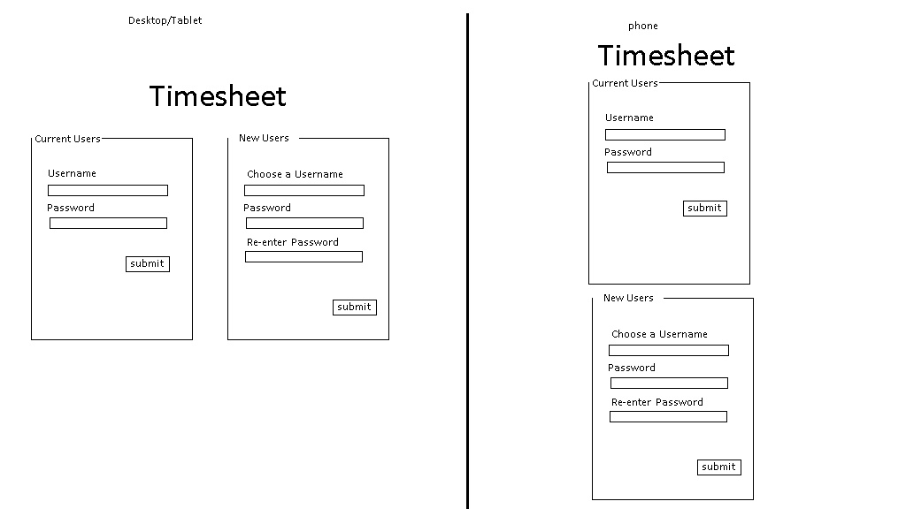
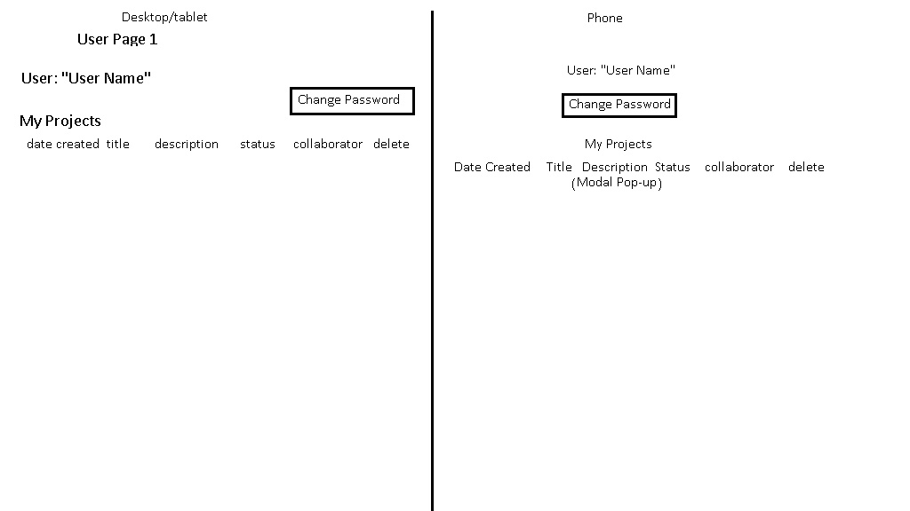
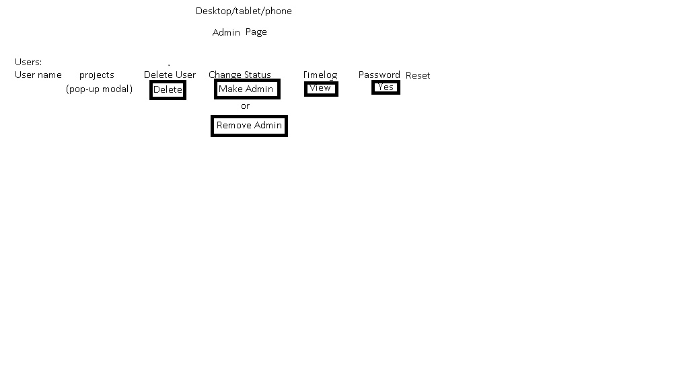

# Activity Log simulator

The following is an example of an activity log where the length of time a user spends performing a simulated activity is logged. In a real-life situation, such a log would be good for monitoring the length of time an employee spends on a task, for example: editing the daily company blog. After creating a mock project, the time spent "performing acitivities" on the project is stored in a log and the data for the log view is accessed through a custom JSON API built using JBuilder.  A generic rails view is used to display the JSON response, although any front end JavaScript technology (Angular, React) or native mobile based app could be used to create the view for the JSON response.

In this app, you can assume two roles, employee or admin.  In either case you must sign up using the sign-up sheet on the right of the screen.  Employee role is default. To enroll as an admin, click the "Role: admin" checkbox. Both usernames and passwords must be at least four characters long for both roles.

As an employee, you can:
1. create a new project
2. view the name and description of the project (which you entered during project creation)
3. perform an "activity" on the project, simulated in this app by pressing the "start activity" and "stop activity" buttons on the users project page.  It is these activities that are logged, and the duration you spent between pressing the "start activity" button and the "stop activity" button is recorded.  This is meant to simulate the time an employee spends performing an actual task in a real-world situation.
4. view all projects of all users
4. change your password

As an admin, you can do everything an employee can, plus:
#### 1. view the timelogs of the activities (only as an admin can you view timelogs), by clicking the "view timelongs" link on the admin page
2. delete projects

The descriptions of my workflow below follow this format:

#. (length of time it takes me) Description

1. (One day) The first task I complete when I start a project is to think about the database design and layout a basic schema.  In this case, we have three models: Users, Projects, and Timelogs. Since more than one person can work on a project, I added a fourth table of collaborators. Therefore I would have the following tables:
 
Users:  
user_id (int) (active record generated)  
first_name (string)  
last_name (string) 
title (string) 
user_name (string) 
password (string) 
 
 
Projects: 
project_id (int) (Active record generated) 
title (string) 
description (text) 
status (string) 
date_created (datetime) 
date_updated (datetime) 
created_by (references user_id - foreign-key) 
 
 
Collobrators: 
project_id (foreign-key) 
collaborator_id (references users - foreign-key) 
role (string) 
 
 
Timelogs: 
log_id (int) (active record generated) 
user_id (foreign key) 
project_id (foreign key) 
datetime (datetime) 
note (text) 
total_time (time) 
 
 
2. (four hours) I now create the models and migrations using rails model generator, and then go back and modify the migrations to account for the associations between tables.

3. (one hour) Then I create wireframes to layout the views. I have created three wireframes for this project: index page, user page, admin page:
 
Index page:  

User page:  

Admin page:  

4. (two hours) I then create the postgres db and run the migrations. I already have a postgres server running locally, so I included the "pg" gem in the gemfile and updated the database.yml file with the username and password for postgres user I created for this project. My next task is to download and include "Bootstrap" as I will now be beginning to create the views.
 

5. (15 mintues) Added bootstrap files by linking from their CDN.  Also created resources and routes for users, projects, timelogs, and api/timelogs. Next step is to start creating views with forms and incorporating bootstrap.

6. (two hours) Forms for new users and current user login were created on the index page.  The page was made responive using bootstrap's grid system. 

7. (two hours) Javascript validation was added to the new user form to make sure fields are not left empty and repeated passwords match.

8. (15 minutes) Custom routes were created in the user controller for the user login and logout routes.  Sometimes this is done with "post" to a "sessions" controller and corresponding actions, but I will be using cookies to keep track of logged in or out status, so having login and logout actions within the user controller is acceptable.

9. (one hour) The "create" action was defined in the users controller and I created a new migration to change the column name of user_name in the users tabe to username, without the underscore. The next step will be to add some validations within the model to prevent duplicate user table entries and to ensure the proper length of characters for the fields. Then I will define the login and logout actions in the user controller.

10. (one hour) The show user view was created with a bootstrap modal to change password.  When the login action is created it will route to this view.

11. (one hour) The login and logout routes were created.  The login route routes to the user page and the logout route back to index.  A change password form within a bootstrap modal was added to the user page.  Next step is to add the users projects to the user page.

12. (two hours) The tables "my projects" (created by the user) and "collaborations" (created by other users but current user is a collaborator) were added to the user show page styled using bootstrap tables.  In the tables, the title of each project links to that project's show page and clicking the abridged description opens a bootstrap modal which has the full description. A join table was created in the users controller to find the projects associated with the collaborations of the current user. I will next create the projects show page and the timelogs show page.

13. (six hours) The timelogs show page and the projects show page were created. The timelogs show page is an html scaffold which on onload sends out an AJAX request to the timelogs controller and receives a JSON response built using Jbuilder, as per project specs. I will next add two buttons to the projects show page, "start activity" and "stop activity", which will simulate an activity occuring and which will send out a JSON POST response to the route "api/timelogs" to create an entry in the timelogs table, as per project specs.

14. (three hours) The project show page was updated with start and stop acitivity buttons which send out ajax responses to the /api/timelogs route to create a timelog entry.

15.  (three hours) An "add note to timelog" modal in the timelog index page and delete project buttons on the projects index page were added which appear only if role=admin. In addition a "create new project" modal was added to the user page, which a user with any role can use.
 
 
 
The project is now complete:

1. If you haven't installed rails locally, visit the railsinstaller website and install rails for your operating system.

2. retrieve the git clone url for this repository by going to the main page of the repository located at https://github.com/srahimi1/posse_test and click on the green "clone or download" button to see the clone url

3. on your local machine, cd into the /sites directory for rails projects and type git clone https://github.com/srahimi1/posse_test.git

4. if you haven't done so, install postgres on your local machine by going to the official postgres website

5. now cd into the directory created by cloning the github repo

6. type "rails db:create"

7. Type "rails db:migrate"

8. type "rails s" to start the rails server, and after it has started, go to http://localhost:3000

9. Create a new admin by using the "create new user form" and checking the role:admin checkbox on the right side of the page

10. create a new project by clicking the blue "create new project" button on the user page

11. after creating new project click on the project description to open a modal with full descrption

12. close modal and click on the title of the project to go to the project page

13. Click the start activity button to simulate an activity being performed on the project

14. click the stop activity button

15. go back to the user page by clicking the user page button on the top left

16. go to view timelogs page

17. add a note to the timelog by clicking on the note and submitting the form that opens in the modal.

18. If an InvalidAuthenticityToken error occurs during any activity, simply reload the page and attempt the action aagain.

